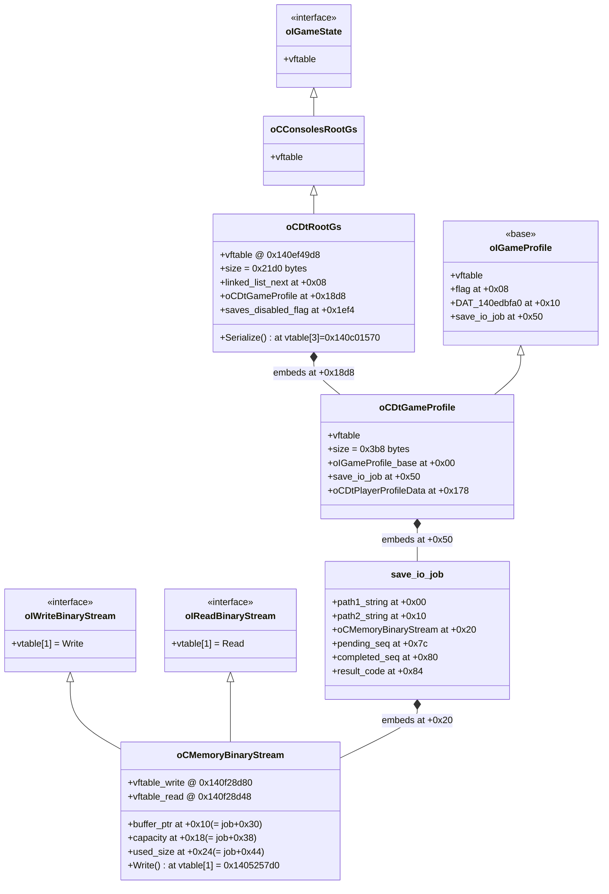
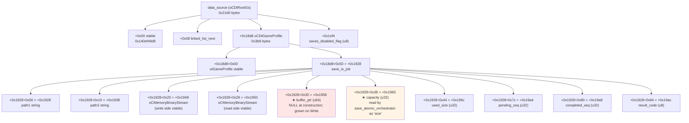
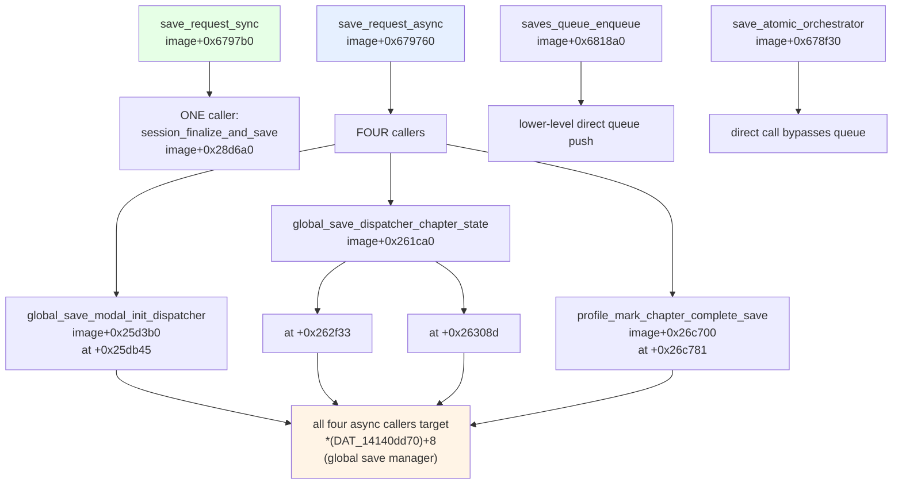
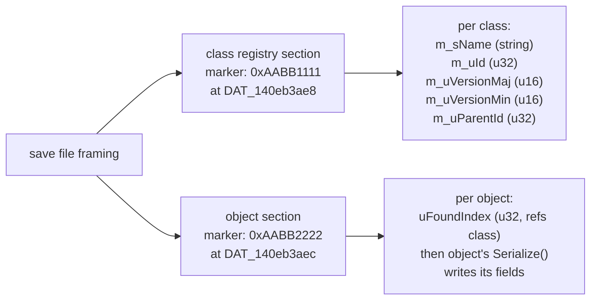

[← Back to findings](README.md)

# Save flow diagrams (Ravenswatch)
**Status:** confirmed


Mermaid diagrams of the save-subsystem architecture, chapter-end event chain,
class hierarchy, and data layout — generated from static analysis 2026-04-29 /
2026-04-30. All addresses absolute (subtract `0x140000000` for RVA). Function
names match the Ghidra DB renames; cross-walk in `save-subsystem.md`.

---

## Sources

- pre-policy — written before the Sources header was mandatory.

## 1. Chapter-end save event chain

End-to-end flow from boss death to `Profile_1.ob` written to disk.

```mermaid
flowchart TD
  subgraph "Chapter setup (runs at chapter start)"
    A[chapter loads] --> B[session_subscribe_chapter_end_events<br/>image+0x27fde0]
    B --> B1["Subscribes ~17 named events<br/>incl. GAME_END_SUCCESS at DAT_1412bfca0"]
    B --> B2["Loads Modal_Save_Or_Quit.entity.ot<br/>DAT_141410b38 → session+0xf8"]
    B --> B3["Publishes GAME_CHRONO_START<br/>via construct_named_event +<br/>publish_event_to_subscribers"]
  end

  subgraph "Boss dies → chapter-end logic"
    C[boss dies] --> D[engine publishes GAME_END_SUCCESS]
    D --> E["LAB_1402c85c0<br/>(vtable adjustor thunk)"]
    E --> F["0x1402835f0<br/>(XOR EDX,EDX; JMP 0x140283520)"]
    F --> G[on_game_end_event_handler<br/>image+0x283520]
    G --> H{game_end_should_show_modal?<br/>image+0x2918b0}
    H -->|no, param_2==0| I[game_end_no_modal_path<br/>image+0x285080<br/>skips dialog → next chapter]
    H -->|yes| J[publish_named_event_game_end<br/>image+0x285710<br/>arg=2]
    J --> J1["constructs oe::dt::NamedEventGameEnd<br/>fans to subscribers"]
  end

  subgraph "NamedEventGameEnd subscriber"
    J1 --> K["thunk at 0x1402c8750<br/>(JMP qword[0x140ef9d48])"]
    K --> L[on_named_event_game_end_handler<br/>image+0x28f140]
    L --> L1[updates profile_data stats<br/>+0x230 +0x234 +0x240 +0x244]
    L --> M{state at param_2+0x60?}
    M -->|3 = WIN| N[session_on_saved_dispatch<br/>image+0x291350]
    M -->|2| O[chapter_end_encyclopedia_and_stats_update<br/>image+0x28f660]
    M -->|else / type mismatch| P[session_on_abandoned_dispatch<br/>image+0x291190]
  end

  subgraph "Saved dispatcher (WIN path)"
    N --> N1["sets phase=3 at session+0x150"]
    N --> N2[chapter_end_work<br/>image+0x2907e0<br/>★ likely runs SerializeArchive walks<br/>★ progressively fills oCMemoryBinaryStream]
    N --> N3["sets saves-enabled flag<br/>session+0xa5 = 1"]
    N --> N4[publishes 'Saved' oCCustomFlagList event<br/>via FUN_14067dea0 0x17cde816]
    N --> N5["updates profile_data->[0x244]<br/>chapter counter"]
    N --> N6[sets session+0x30 = 1]
  end

  subgraph "User clicks Save and quit"
    N6 --> Q[Modal_Save_Or_Quit dialog<br/>at session+0xf8]
    Q --> R[user clicks Save and quit]
    R --> S[modal callback fires<br/>—mechanism TBD—]
    S --> T[session_finalize_and_save<br/>image+0x28d6a0]
  end

  subgraph "Save dispatch (queue → worker → file)"
    T --> T1["pre-save plumbing<br/>FUN_14026f750/620<br/>scene-context iteration"]
    T --> T2["★ vtable[0xd0] indirect call:<br/>scene_manager+0x708 →+0x38 → vt[0xd0]<br/>(STRONGEST UNRESOLVED PREP CANDIDATE)"]
    T --> T3[io_request_list_clear<br/>swap_subscribed_pointer<br/>profile_data manager updates]
    T --> T4["walks linked list at session+8<br/>finds oCDtRootGs by typedesc"]
    T4 --> T5{*data_source+0x1ef4 == 0?<br/>(saves-enabled flag)}
    T5 -->|yes| U["save_request_sync(NULL,<br/>data_source+0x1928)<br/>image+0x6797b0"]
    T5 -->|no| Z[skip save]
    U --> V[saves_queue_enqueue<br/>image+0x6818a0]
    V --> W[ReleaseSemaphore<br/>g_saves_queue_semaphore]
    W --> X[saves_manager_worker_thread<br/>image+0x679150<br/>opcode=1=SAVE]
    X --> Y1[save_atomic_orchestrator<br/>image+0x678f30]
    Y1 --> Y2["reads *(job+0x30)<br/>and *(job+0x38)"]
    Y2 --> Y3[oCFileBinaryStream::Write<br/>vtable[1] at 0x140f28d98]
    Y3 --> Y4["writes Profile_1_Temp.ob<br/>then CopyFileW → Profile_1.ob"]
  end

  style L fill:#ffe6e6
  style N2 fill:#fff4e6
  style T2 fill:#ffe6e6
  style U fill:#e6ffe6
```

---

## 2. Save subsystem threading & queue

The worker-thread side of the save (post-enqueue).

```mermaid
flowchart LR
  subgraph "Main thread"
    A1["save_request_sync<br/>image+0x6797b0"] --> A2["increment job+0x7c (pend)"]
    A2 --> A3["saves_queue_enqueue<br/>image+0x6818a0"]
    A3 --> A4["push 16-byte entry to ring queue<br/>at DAT_14143ffc0"]
    A4 --> A5["ReleaseSemaphore<br/>DAT_14143ff98"]
    A5 --> A6["busy-wait on job+0x80 (done)"]
  end

  subgraph "Worker thread"
    B1[saves_manager_worker_thread<br/>image+0x679150] --> B2["WaitForSingleObject<br/>on semaphore"]
    A5 -.signals.-> B2
    B2 --> B3["dequeue 16-byte entry"]
    B3 --> B4{opcode at job+0xc?}
    B4 -->|0 = LOAD| B5["FUN_140679810(job, DAT_14140e9c8)"]
    B4 -->|1 = SAVE| B6[save_atomic_orchestrator<br/>image+0x678f30]
    B4 -->|2 = DELETE| B7["(*DAT_14140e9e0)(job, &name)"]
    B6 --> C1[EnterCriticalSection<br/>manager+0x20]
    C1 --> C2[FUN_14064b2f0 pre-save]
    C2 --> C3[pre-save guard stub<br/>always returns 1 on PC]
    C3 --> C4["job+0x79 = 1 (TEMP mode)"]
    C4 --> C5["FUN_140679810(job, DAT_14140e9c0)<br/>writes Profile_1_Temp.ob"]
    C5 --> C6["job+0x79 = 0 (TEMP mode off)"]
    C6 --> C7[FUN_1405229b0<br/>CopyFileW Temp → real]
    C7 --> C8["increment job+0x80 (done)<br/>set job+0x84 (result code)"]
    C8 --> C9[LeaveCriticalSection]
    C9 --> B2
    C8 -.unblocks.-> A6
  end

  style A6 fill:#ffe6e6
  style B6 fill:#e6e6ff
```



---

## 3. Class hierarchy & data layout (oCDtRootGs)

The data_source struct with the embedded oCMemoryBinaryStream.



---

## 4. Memory offsets (data_source absolute layout)

Where the buffer pointer and size live within data_source.



---

## 5. Serialization paths (settings save vs run-state save)

Two distinct serializer paths. The settings path uses oCBinarySaver+oCFileBinaryStream
(direct file). The run-state path uses an embedded oCMemoryBinaryStream that grows
in memory, then save_atomic_orchestrator copies bytes to disk.

```mermaid
flowchart TB
  subgraph "Settings save path (GameSettings.ini, profile data)"
    S1[settings_serialize_load_or_save_ini<br/>image+0x64b2f0] --> S2[oCBinarySaver constructor<br/>image+0x4e8ca0]
    S2 --> S3["oCBinarySaver instance<br/>vtable @ 0x140f235e0"]
    S3 --> S4["embedded oCFileBinaryStream<br/>at saver+0x20<br/>vtable @ 0x140f28d98"]
    S4 --> S5["serialize_object_with_name<br/>(FUN_1404e9350)<br/>writes class registry +<br/>object section markers<br/>(0xAABB1111, 0xAABB2222)"]
    S5 --> S6[per-object Serialize<br/>vtable slot 3 of each object]
    S6 --> S7["oCFileBinaryStream::Write<br/>image+0x140f28d98 vt[1]"]
    S7 --> S8[direct file write to .ini]
  end

  subgraph "Run-state save path (Profile_1.ob, chapter end)"
    R1[chapter_end_work<br/>image+0x2907e0<br/>★ likely entry] --> R2["serializer / archive<br/>writes to embedded stream<br/>via vtable dispatch"]
    R2 --> R3["embedded oCMemoryBinaryStream<br/>at data_source+0x1948"]
    R3 --> R4["oCMemoryBinaryStream::Write<br/>image+0x5257d0 vt[1]<br/>grows buffer dynamically"]
    R4 --> R5["buffer accumulated at<br/>*(data_source+0x1958)<br/>size at *(data_source+0x1960)"]
    R5 --> R6["save_request_sync(NULL, job)<br/>via session_finalize_and_save"]
    R6 --> R7[saves_manager_worker_thread]
    R7 --> R8[save_atomic_orchestrator]
    R8 --> R9["read *(job+0x30) + *(job+0x38)<br/>write to Profile_1_Temp.ob<br/>via oCFileBinaryStream::Write"]
    R9 --> R10[CopyFileW → Profile_1.ob]
  end

  style R3 fill:#fff4e6
  style R4 fill:#ffe6e6
```



---

## 6. Save call topology (verified)



---

## 7. Save format magic markers (binary save framing)

Discovered in `FUN_1404e9350` (serialize_object_with_name).



---

## 8. Anti-debug tripwires (empirical, 2026-04-29)

```mermaid
flowchart LR
  A[Game running] --> B{WinDbg attached?}
  B -->|no| C[normal operation]
  B -->|yes| D{game-state transition?}
  D -->|main menu / settings save| E[OK — BPs work]
  D -->|boss-spawn| F["__debugbreak() fires<br/>process exits with<br/>STATUS_BREAKPOINT 0x80000003"]
  D -->|boss-kill| G["__debugbreak() fires<br/>process exits with<br/>STATUS_BREAKPOINT 0x80000003"]
  D -->|chapter-end animation<br/>(post-boss-die window)| H[OK — attach during<br/>this window is safe]

  style F fill:#ffcccc
  style G fill:#ffcccc
  style H fill:#ccffcc
```

---

## 9. Prep chain (refined 2026-04-30 night)

End-to-end chain from session_finalize_and_save into the static prep candidate. The
green node is the runtime-installed slot — its concrete class is selected by GameMode
name and cannot be pinned by static analysis.

```mermaid
flowchart TD
  A[session_finalize_and_save<br/>image+0x28d6a0<br/>= GameSessionGs::vtable&#91;6&#93;] --> A1[FUN_14026f750/620<br/>list/state plumbing]
  A1 --> B{session+0xa5<br/>saves enabled?}
  B -->|no| B1[profile_data_manager+0x198<br/>vtable&#91;0x10&#93; teardown]
  B -->|yes| C["R14 = *(scene_manager+0x708)<br/>= oe::dt::GameModeDefault*<br/>(size 0x48)"]
  C --> D["RCX = *(R14+0x38)<br/>★ runtime-installed subsystem"]
  D --> E["serializer = RCX->vtable&#91;0xf8&#93;()<br/>factory.create_serializer()"]
  E --> F["serializer->vtable&#91;0x40&#93;(R14)<br/>★ THE PREP — populates memstream"]
  F --> G[profile_data_manager+0x1e0 = serializer<br/>cache for later teardown]
  B1 --> H[walk session+8 list<br/>→ data_source]
  G --> H
  H --> I["save_request_sync(NULL, data_source+0x1928)"]

  subgraph "Earlier in session_finalize_and_save (NOT prep)"
    Z["scene_manager+0x230<br/>= cached oCDtP2PSessionSceneContext"]
    Z --> Z1["vtable&#91;0xd0&#93; =<br/>oCDtP2PSession_shutdown_raknet<br/>(network teardown, NOT prep)"]
  end

  style D fill:#e6ffe6
  style F fill:#ffe6e6
  style Z1 fill:#cccccc
```



## 10. GameModeDefault+0x38 install path (registry by name)

How the prep target gets installed. Static analysis reveals the mechanism but cannot
resolve the concrete class.

```mermaid
flowchart LR
  A[oe_dt_GameMode_constructor<br/>image+0x31b950] --> A1["param_1+0x38 = NULL"]
  A1 --> B[scan registry<br/>*(DAT_141447698+0x30)]
  B --> C{entry+0x8 ==<br/>magic 0x53b64d?}
  C -->|no| B
  C -->|yes| D["handler = entry+0x10"]
  D --> E["handler->vtable&#91;0x18&#93;(<br/>  handler,<br/>  name_string,<br/>  _DAT_1412c7590,<br/>  &param_1+0x38, ←OUT<br/>  0)"]
  E --> F["+0x38 ← concrete subsystem*<br/>(class depends on name_string)"]

  G[module_registry_init_with_magic_0x53b64d<br/>image+0x442bb0] --> G1[iterate global module list<br/>DAT_141414090]
  G1 --> G2[per module:<br/>insert entry tagged 0x53b64d<br/>into per-module registry]

  style F fill:#fff4e6
```

## 11. Modal_Save_Or_Quit.entity.ot decoded layout

The cooked `.gen` format that defines the chapter-end save dialog.

```mermaid
flowchart TD
  A["File header (16 bytes)<br/>'Cooked' identifier"] --> B[u32 count + u8 marker]
  B --> C["0xAABB1111 — section start"]
  C --> D[Class registry<br/>14 classes for this modal]
  D --> D1[oCEntitySettingsResource]
  D --> D2[oCEntityCpntWindowUiSettings]
  D --> D3[oCEntityCpntLabelUiSettings × N buttons]
  D --> D4[oCEntityCpntPicker / oIUniqueObjectPicker<br/>references Modal_Model.entity.ot]
  C --> E["0xAABB1111 — object section start"]
  E --> F["Object bodies<br/>class_index + 16-byte GUID + class fields"]
  F --> F1[Title<br/>→ Message_Save_And_Quit_Title<br/>(Common~GAM.xls)]
  F --> F2[Description<br/>→ Message_Save_And_Quit_Description]
  F --> F3["★ Cancel button<br/>→ Message_Save_And_Quit<br/>(USER-FACING 'Save and Quit')"]
  F --> F4[Validate button<br/>→ Message_Continue<br/>USER-FACING 'Continue']
  F --> G["0xAABB2222 — section end"]

  H["NOTE: no callback IDs in .gen<br/>buttons are abstract Cancel/Validate<br/>wiring is C++-bound<br/>OnCancel of host = 'Save and Quit'"]

  style F3 fill:#ffe6e6
  style H fill:#fff4e6
```

## Key unresolved items

1. **Where exactly is `*(data_source + 0x1958)` first written non-NULL?** Static analysis hits a ceiling because the write happens via vtable-dispatched `oCMemoryBinaryStream::Write` calls that aren't in the xref graph. The cleanest path forward is a hardware data breakpoint on the buffer-pointer slot during a real chapter run. The instruction at the fire point IS the prep call.
2. **What is `oCDtRootGs::vtable[3]` (= 0x140c01570) actually?** Disassembly shows it's a code chunk inside a larger function (`FUN_140c01480`) that uses critical sections — looks like a thread-safe init/finalizer, not a Serialize method. The data_source's actual Serialize entry may be at a different vtable slot or invoked via a different mechanism.
3. **Modal callback → `session_finalize_and_save` link.** When the user clicks Save and quit on the modal, what wires the click to invoke `session_finalize_and_save`? The vtable that holds it (at `0x140efa120` slot 0) has no callers in static xrefs.

## Cross-references

- `rw/findings/save-subsystem.md` — full architecture and function map
- `rw/findings/frida-pipeline-hardware-breakpoint.md` — operational doc for Frida save-trigger
- `rw/docs/ghidra-windbg-mcp-for-wsl.md` — debugger setup and known limitations
- `.ai/scratch/rw-parallel-findings.md` — side discoveries (anti-debug, RTTI, false leads)
- `.ai/scratch/rw-context-handoff-20260430-010309.md` — supersedes prior handoffs
